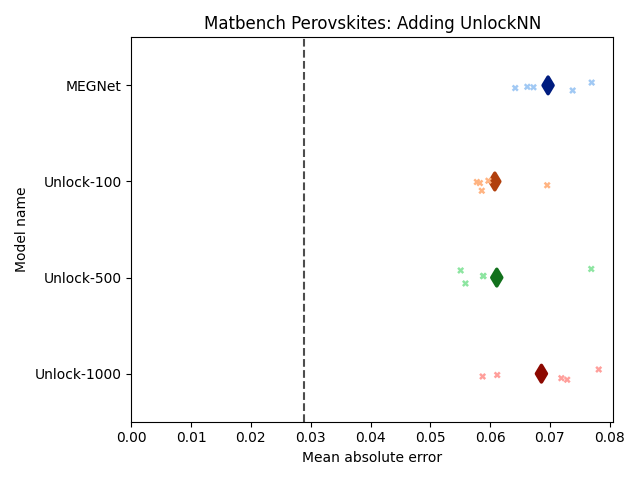
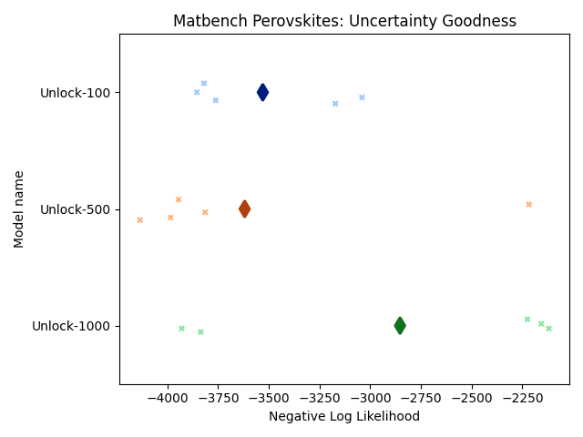
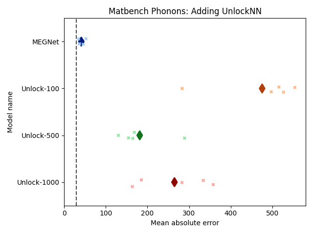
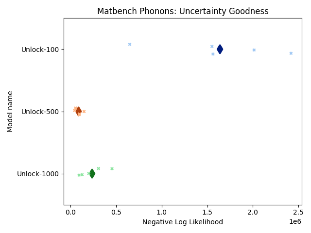
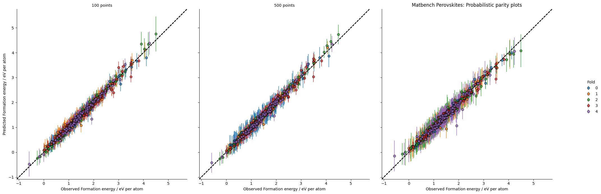
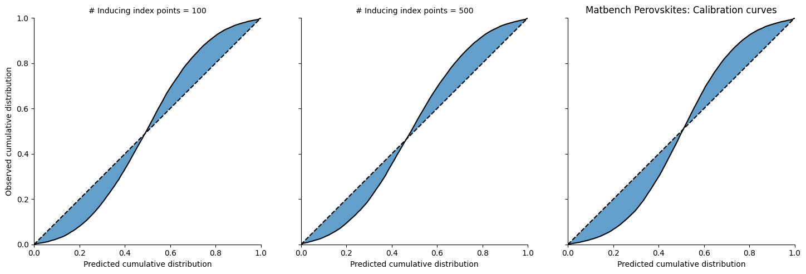
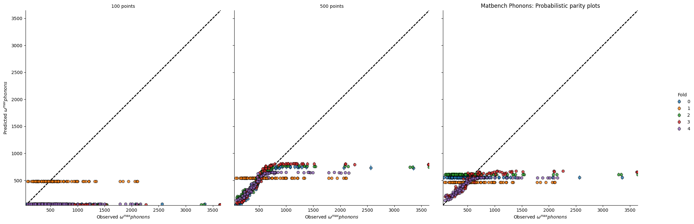
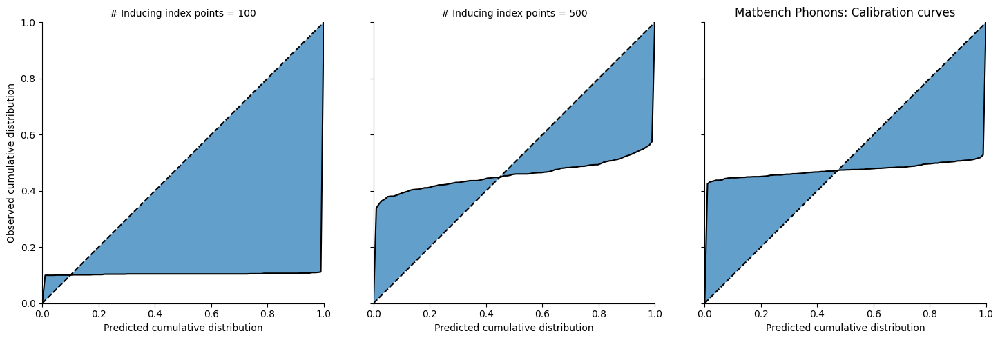

# Matbench

## Method

These benchmarks were carried out as described in the
[paper](https://doi.org/10.1038/s41524-020-00406-3): 5-fold cross-validation,
split using ``scikit-learn`` with a random seed of 18012019. Separate MEGNet
models were trained for each fold. These trained models were then converted to
``MEGNetProbModel``s using UnlockNN, which in turn were trained on the same
training data as their respective MEGNet model. For each MEGNet model, three
``MEGNetProbModel``s were created that differed by their number of inducing
index points: 100, 500 and 1000. Every model was evaluated on its respective
test subset. The metrics across every fold were averaged to determine the
models' overall scores.

## Metrics

These metrics are reported in the table below. The ``MEGNetProbModels`` are named
'Unlock-``<# inducing points>``'. Lower metric scores are better:

|     Dataset     | Model       |  Mean absolute error | Negative log likelihood |
| :-------------: | ----------- | -------------------: | ----------------------: |
| **Perovskites** | MEGNet      |       0.0697 eV/atom |                     N/A |
|                 | Unlock-100  |       0.0608 eV/atom |                   -3530 |
|                 | Unlock-500  |       0.0611 eV/atom |                   -3620 |
|                 | Unlock-1000 |       0.0686 eV/atom |                   -2850 |
|   **Phonons**   | MEGNet      | 41.1 cm-1 |                     N/A |
|                 | Unlock-100  |  476 cm-1 |      $1.64 \times 10^6$ |
|                 | Unlock-500  |  180 cm-1 |      $8.76 \times 10^4$ |
|                 | Unlock-1000 |  265 cm-1 |      $2.36 \times 10^5$ |

The following graphs show the individual folds' scores (crosses) and their averages (diamonds).
The current leading matbench score for mean absolute error is marked with a dashed line. The benchmark
does not have a category for negative log likelihood so these results cannot be compared against any other.

### Perovskites metrics graphs

### Phonons metrics graphs

## Calibration

Calibration curves are a way of visualising how well the probabilistic model's
residuals align with the predicted distributions. For a well calibrated model,
5% of residuals should lie below the 95% confidence interval and 5% above it. By
plotting the normalized cumulative distribution of the probability percentile in
which each residual lies, we can visually inspect how over-/underconfident a
model is. See also this [paper](https://doi.org/10.1088/2632-2153/ab7e1a).

To produce the calibration curves and parity plots here, the predictions for
every model on their respective test subset were concatenated. In this way,
there was exactly one prediction for every point in the dataset. The residual of
each prediction contributed to the cumulative distribution.

Parity plots are also provided to give a more intuitive way of visualising the
confidence intervals predicted by the models. In each case, two standard
deviations (the 95% confidence interval) are plotted for 125 randomly sampled
points. The same materials (i.e. same inputs) and the respective predictions
are plotted for each choice of number of inducing index points.

### Perovskites calibration

### Phonons calibration

